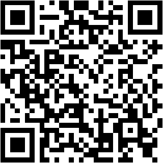

# 保持学习

汽车电子课程自学习应用（PWA），58 节课程，手机端可安装。

## 功能

- 课程阅读 + Mermaid 图表
- 选择题自动判分
- 费曼题（用自己的话复述）
- AI 评分（需自备 API Key，存浏览器本地）
- 学习进度记录（localStorage）
- 离线学习（Service Worker 缓存全部课程）

## 使用

手机浏览器打开后点「添加到桌面」即可安装为应用。首次打开自动缓存全部课程，之后断网也能学。

## API Key 配置教程（AI 评分）

选择题**不需要配置**，本地即可自动判分。只有**费曼题的 AI 自动评分**需要 API Key。

**1. 打开配置**

进入任意一节课的讲解页，点按钮区的 **⚙️ 配置** 按钮。

**2. 选服务商 + 填 Key**

- **DeepSeek**（默认，推荐）：到 [platform.deepseek.com/api_keys](https://platform.deepseek.com/api_keys) 充值后创建 Key，复制 `sk-` 开头的密钥，粘贴到 **API Key** 框，点 **保存**。
- **OpenAI**：到 [platform.openai.com/api_keys](https://platform.openai.com/api_keys) 创建 Key，服务商选 **OpenAI**。
- **OpenRouter**：到 [openrouter.ai/keys](https://openrouter.ai/keys) 创建 Key，服务商选 **OpenRouter**，一个平台可切换多种模型。
- **Ollama**（本地电脑）：**不需要 Key**，模型名填本机已安装的模型（如 `qwen2.5:7b`）。**手机网页版不适用**，因为 `localhost` 指向手机本身。

**3. 模型名**

模型名**留空即可**，会自动用各服务商的默认模型；也可自行填写。

**说明**

- API Key 只保存在**你浏览器本机的 localStorage** 里，不上传、也不进入 GitHub 仓库；换设备或清缓存后需重新填写。
- 配置完成后，回到费曼题点 **提交评分**，即可获得 AI 自动评分。

## 下载 App（Android APK）

扫码或点链接下载安卓安装包（**仅安卓手机**；鸿蒙 NEXT / iPhone 请用上面的网页版）：

下载地址：https://keeplearning-2026.obs.cn-south-1.myhuaweicloud.com/keeplearning.apk.1

> 下载后把 `keeplearning.apk.1` 改名成 `keeplearning.apk` 再安装。
> APK 为 debug 签名，安装时需在设置里允许「未知来源」。

## 目录结构

- `index.html` — 移动首页（搜索 + 进度 + 课程列表）
- `Lesson01~58/` — 课程内容（课程.html 讲解、答案.html 参考答案）
- `ai-grader.js` — AI 评分
- `teachme-tracker.js` — 进度记录
- `sw.js` / `manifest.webmanifest` — 离线缓存 / PWA 清单
